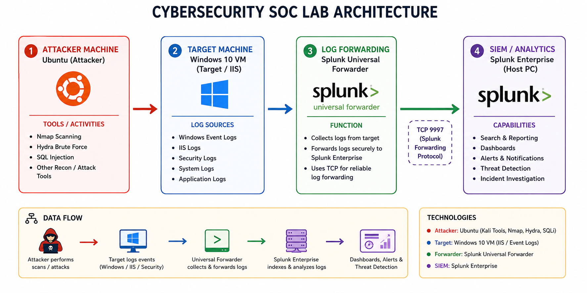
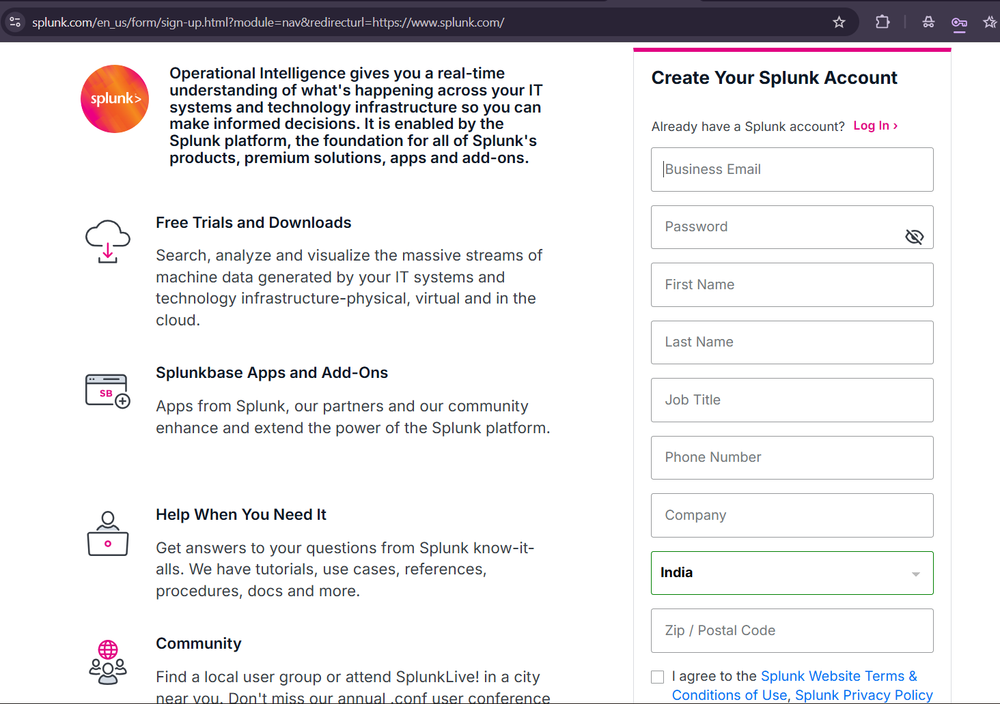
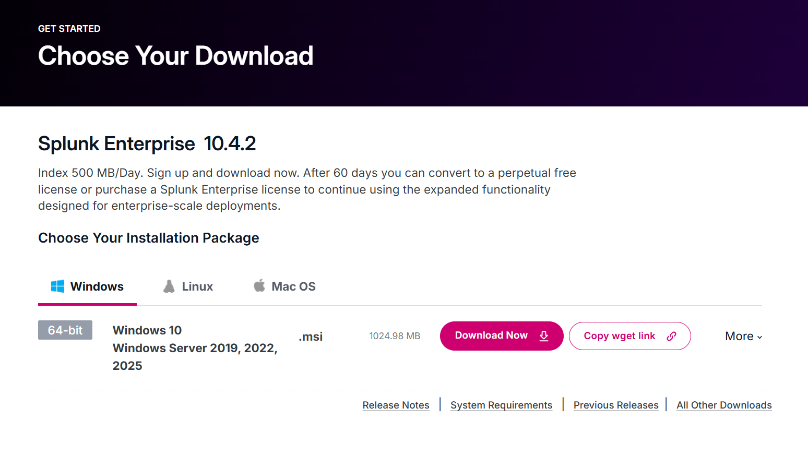
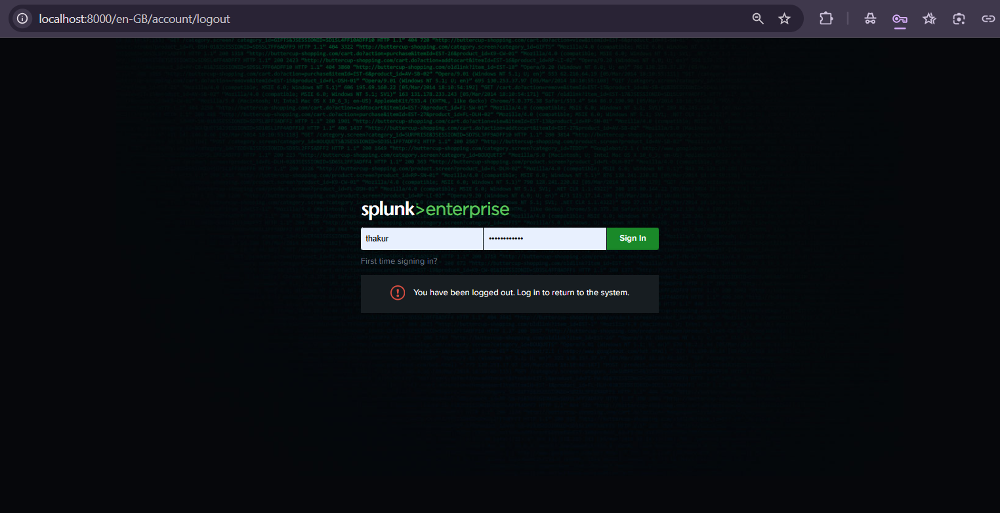
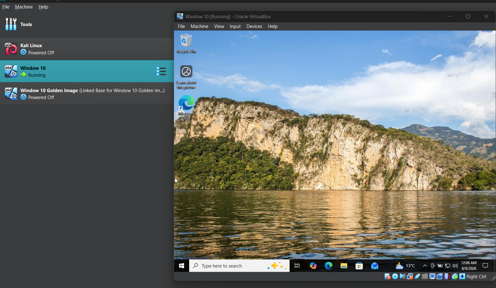
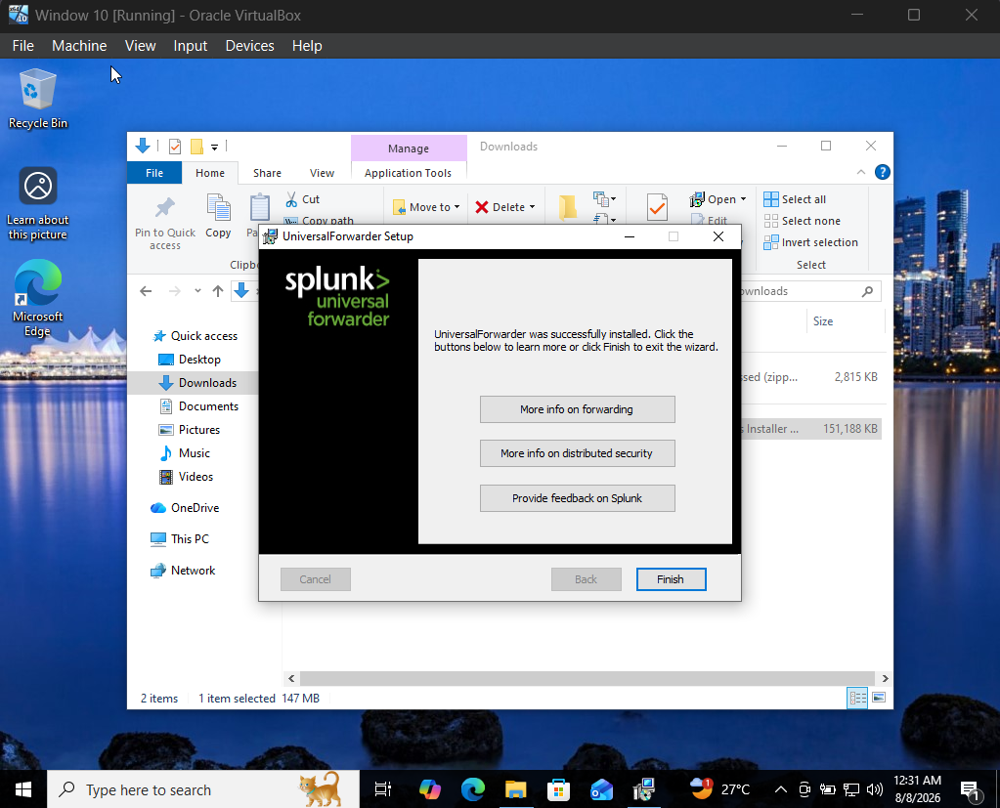
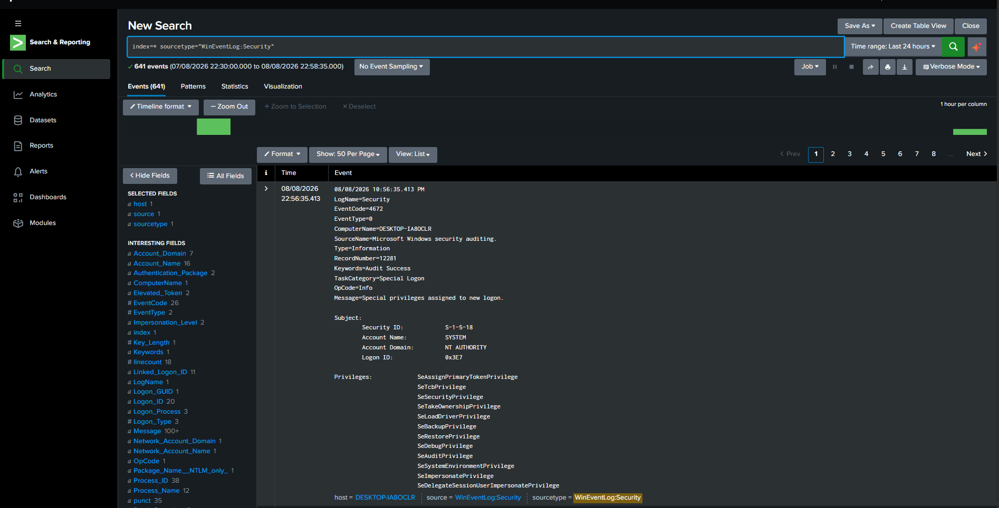

# Lab Setup

## Objective

The objective of this lab is to build a basic Security Operations Center (SOC) environment using Splunk Enterprise for centralized log collection, monitoring, and threat detection. The lab simulates how security analysts collect logs from endpoints, detect attacker activity, and investigate security events.

---

## Lab Architecture

The lab consists of an attacker machine (Ubuntu), a target Windows 10 endpoint, and a Splunk server running on the host machine.




The Ubuntu attacker machine scans and attacks the Windows 10 IIS web server (Nmap reconnaissance, Hydra brute-force, SQL injection attempts). The resulting Windows Event Logs, IIS logs, and Snort alerts are collected by the Universal Forwarder and sent to Splunk Enterprise for indexing, search, and detection.

---

## Components Used

| Component | Purpose |
|----------|---------|
| Ubuntu VM (Attacker) | Simulates attacks — Nmap scans, Hydra brute-force, SQL injection |
| Windows 10 VM (Target) | Runs IIS, generates Windows Event Logs |
| Splunk Universal Forwarder | Collects and forwards logs from the target |
| Splunk Enterprise | Receives, indexes, and analyzes logs |
| VirtualBox | Hosts both the Windows and Ubuntu virtual machines |

---

## Step 1: Create a Splunk Account

1. Go to [splunk.com](https://www.splunk.com/) and click **Free Trial** (or **Sign Up**).
2. Choose **Splunk Enterprise Free Trial** — this gives full-featured access for 60 days, no credit card required.
3. Fill in your email and create an account. Verify your email if prompted.
4. Once logged in, you'll land on the **Splunk Downloads** page — keep this open for Step 2.



---

## Step 2: Install Splunk Enterprise (on Host Machine)

1. From the Downloads page, select your OS (Windows/Linux/macOS) and download the installer.



2. Run the installer:
   - Accept the license agreement.
   - Create an **admin username and password** — you'll use this to log into the Splunk web interface. Save it somewhere safe.
   - Keep the default installation path and management port (**8089**) unless you have a specific reason to change them.
3. Once installation completes, Splunk starts automatically. Open a browser and go to:
   ```
   http://localhost:8000
   ```
4. Log in with the admin credentials created above.

**✅ Checkpoint:** You should now see the Splunk Enterprise home screen.



---

## Step 3: Set Up the Windows 10 Endpoint (Target VM)

1. Install **VirtualBox** (or your preferred hypervisor) on the host machine.
2. Create a new VM and install **Windows 10** using an ISO image. Install and configure **IIS** so the box has a live web service to be attacked and to log against.
3. Allocate at least 2 vCPUs and 4GB RAM for smooth performance.
4. Set the VM's network adapter to **Bridged Adapter** (or **Host-Only + NAT**) so it can reach both the host machine and the attacker VM over the network.
5. Once Windows 10 boots, note down its IP address (`ipconfig` in Command Prompt) — the attacker VM and the forwarder configuration will both need this.

**✅ Checkpoint:** Windows 10 VM is running, IIS is reachable, and the host can connect to it.



---

## Step 4: Set Up the Ubuntu Endpoint (Attacker VM)

1. In VirtualBox, create a new VM and install **Ubuntu** (Desktop or Server edition).
2. Allocate at least 2 vCPUs and 2–4GB RAM.
3. Set the network adapter to the **same network mode** as the Windows 10 VM (Bridged, or the same Host-Only network) so it can reach the target.
4. Install attacker tooling:
   ```bash
   sudo apt update
   sudo apt install nmap hydra sqlmap -y
   ```
5. Verify connectivity to the Windows 10 target:
   ```bash
   ping <windows10-vm-ip>
   nmap <windows10-vm-ip>
   ```

**✅ Checkpoint:** Ubuntu VM can reach the Windows 10 target and Nmap returns open ports (e.g., 80/443 for IIS).

---

## Step 5: Enable a Receiving Port on Splunk (Host Machine)

Before installing the forwarder, tell Splunk Enterprise to listen for incoming forwarded data.

1. In the Splunk web interface, go to **Settings → Forwarding and receiving**.
2. Under **Receive data**, click **Add new**.
3. Set the listening port to **9997** (default) and click **Save**.
4. Note the **host machine's IP address** (`ipconfig`/`ifconfig`) — the forwarder on the Windows VM will need this to know where to send logs.

---

## Step 6: Install Splunk Universal Forwarder (on Windows 10 VM)

1. On the **host machine's** Splunk Downloads page, select **Universal Forwarder**, choose Windows, and download the installer.
2. Transfer the installer to the Windows 10 VM (via shared folder, USB, or direct download inside the VM).
3. Run the installer on the VM:
   - Accept the license agreement.
   - When prompted for **deployment server**, you can skip this for a simple lab setup.
   - When prompted for the **receiving indexer**, enter the host machine's IP address and port `9997`.
   - Create a forwarder admin username/password (can differ from the Splunk Enterprise credentials).
4. Complete the installation. The Universal Forwarder runs as a Windows service in the background.

**✅ Checkpoint:** Universal Forwarder is installed and running on the Windows endpoint.



---

## Step 7: Configure Log Forwarding (Windows Event Logs)

1. On the Windows VM, navigate to the Universal Forwarder install directory, typically:
   ```
   C:\Program Files\SplunkUniversalForwarder\etc\system\local\
   ```
2. Create or edit `inputs.conf` to forward Windows Event Logs:
   ```ini
   [WinEventLog://Security]
   disabled = false
   index = main

   [WinEventLog://System]
   disabled = false
   index = main

   [WinEventLog://Application]
   disabled = false
   index = main
   ```
3. Restart the Splunk Forwarder service for changes to take effect:
   ```
   net stop SplunkForwarder
   net start SplunkForwarder
   ```

*(IIS log forwarding and Snort log forwarding are configured separately — see `iis-logs.md` and `snort-logs.md`.)*

---

## Step 8: Verify Data Is Flowing into Splunk

1. On the host machine, open the Splunk web interface and go to **Search & Reporting**.
2. Run a basic search to confirm logs are arriving:
   ```spl
   index=main | stats count by sourcetype
   ```
3. You should see event counts for `WinEventLog:Security`, `WinEventLog:System`, and `WinEventLog:Application`.
4. If no data appears, check:
   - Windows Firewall isn't blocking port 9997 on either machine.
   - The forwarder service is running (`services.msc` on the VM).
   - The receiving port is correctly configured on the host (Step 5).

**✅ Checkpoint:** Search results return live events from the Windows endpoint — the pipeline is working end-to-end.



---

## Summary

Starting from a fresh Splunk account, this setup walks through installing Splunk Enterprise on the host machine, provisioning a Windows 10 target endpoint (running IIS) and an Ubuntu attacker VM in VirtualBox, and deploying the Splunk Universal Forwarder to collect Windows Event Logs. By the end of this stage, the attacker VM can reach and scan the target, the Windows endpoint is generating security events, the Universal Forwarder is collecting them, and Splunk Enterprise is indexing them — laying the foundation for the attack simulation, detection, dashboarding, and alerting work covered in the next sections of this lab.