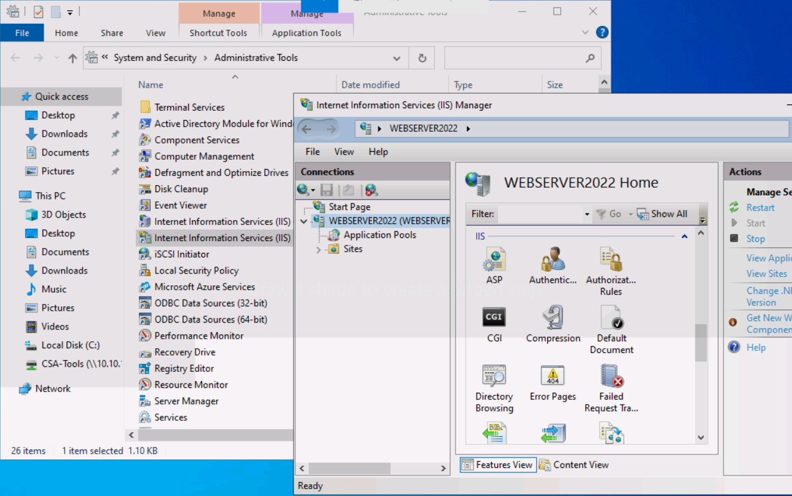
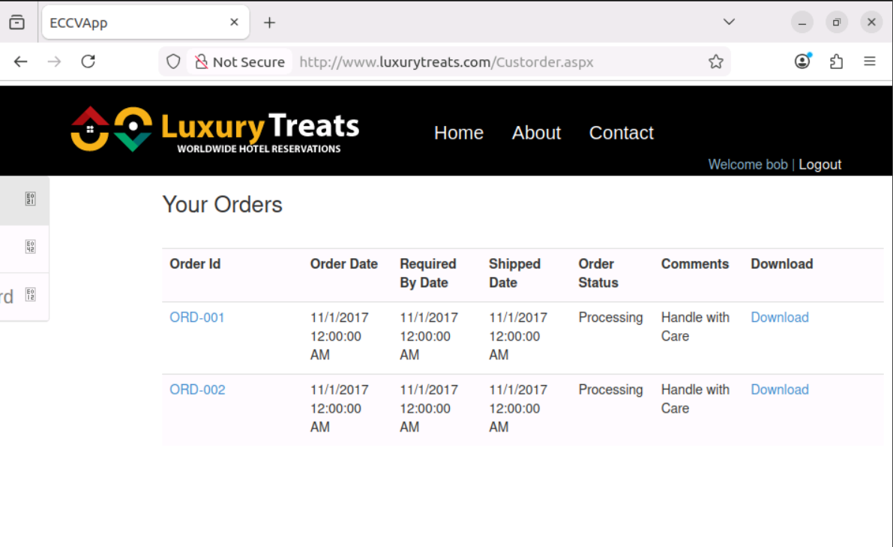
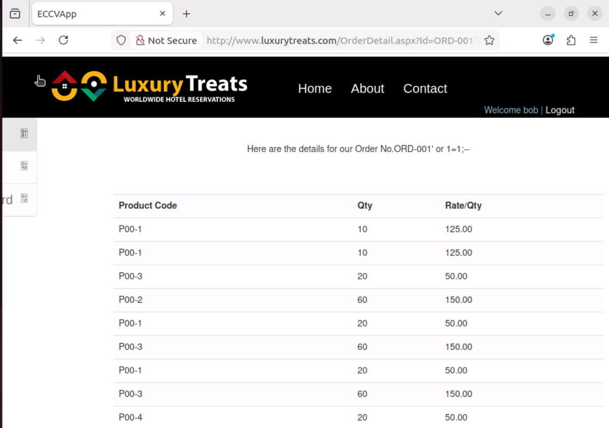
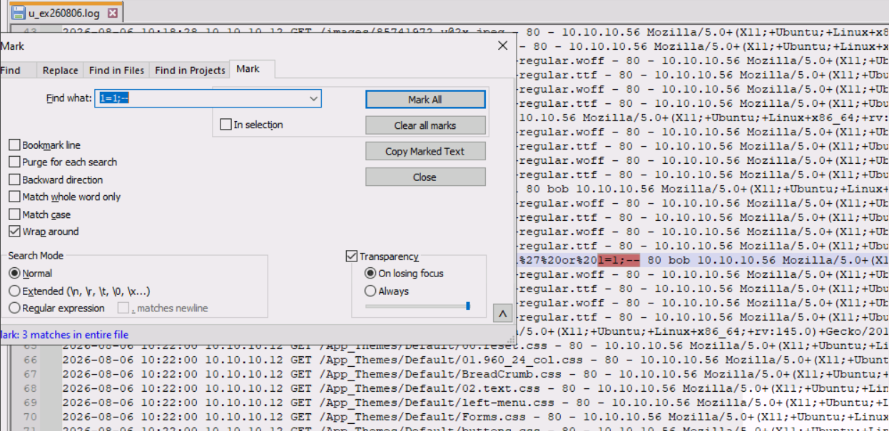

# IIS Logs

## Configuring, Monitoring, and Analyzing IIS Logs

Internet Information Services (IIS) is a web server for Windows Server that hosts web applications, websites, and services. Monitoring IIS logs provides insight into user activities and helps detect anomalous behavior. IIS logs can also be examined to understand potential security breaches.

As a SOC Analyst, the information stored in IIS logs helps detect attacks targeting web applications.

---

## 1. Configure IIS Logging

Open the **Web Server (Windows 10)**.

To open **IIS Manager**, follow the steps below:

i. Click **Start → Windows Administrative Tools**.

ii. Double-click **Internet Information Services (IIS) Manager**.

iii. From the **Connections** pane, select **WEBSERVER2022**. IIS logging is enabled by default. To verify this, double-click the **Logging** feature under the IIS section.

iv. Expand the **WEBSERVER2022** node to view all the websites hosted on the server.



The **Logging** pane displays the directory where IIS stores its log files.

```text
%SystemDrive%\inetpub\logs\LogFiles
```

To include additional information in the log file, click **Select Fields...**, choose the required fields, and click **OK**.

---

## 2. Generate IIS Logs

Now start the **Attacker Machine (Ubuntu)**.

### Steps

i. Open **Firefox**.

ii. Browse to:

```text
http://www.luxurytreats.com
```

iii. Ensure that the SQL Server service is running on the Web Server so the **LuxuryTreats** website is accessible.

iv. Assume you are a registered user and log in using the provided credentials.



After logging in, open the order details for:

```text
ORD-001
```

Now perform a SQL Injection attack by modifying the URL as shown below:

```text
http://www.luxurytreats.com/OrderDetail.aspx?Id=ORD-001' or 1=1;--
```

This SQL Injection payload returns the order details of other users.

When an attacker submits this type of SQL Injection query, it bypasses the application's security checks and may expose sensitive information stored in the database.



---

## 3. Verify IIS Logs

Return to the **Web Server (Windows 10)**.

### Steps

i. Open **File Explorer**.

ii. Navigate to:

```text
C:\inetpub\logs\LogFiles
```

iii. Open the **W3SVC2** folder. This folder contains the IIS logs for the **LuxuryTreats** website (Website ID 2).

iv. Open the latest log file using **Notepad++**.

v. Search for the SQL Injection payload:

```text
1=1;--
```



The IIS log records the HTTP request made to the web application, including the malicious SQL Injection payload. By examining these log entries, a SOC Analyst can identify suspicious requests and investigate potential attacks.

---

## Log Storage Location

By default, IIS stores its log files at:

```text
%SystemDrive%\inetpub\logs\LogFiles
```

Each website has its own **W3SVC** folder, where log files are generated daily.

In this way, IIS keeps track of user activities and web requests in the form of logs. These logs can later be collected by the Splunk Universal Forwarder and forwarded to Splunk Enterprise for monitoring, searching, dashboard creation, and threat detection.