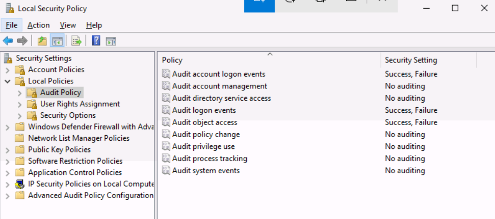
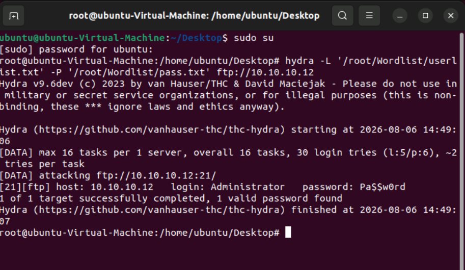
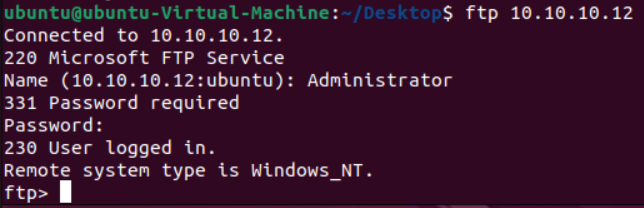
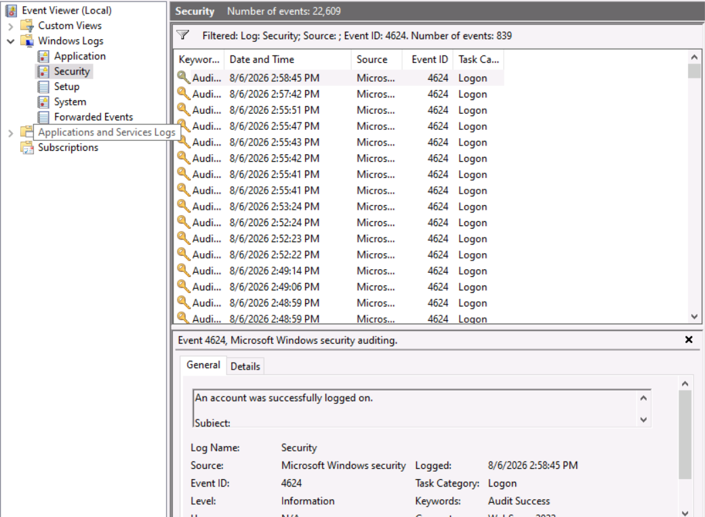

# Local Logging

Windows OS tracks various events, activities, and functions through logs. The events recorded are categorized as **Application, Security, Setup, System,** and **Forwarded Events**.

## Configure Windows Audit Policy

Now start the **Web Server (Windows 10)** where we will collect the logs for failed and successful login events.

Windows Audit Policy decides what data is logged in the Security logs.

### Configuration

i. Open **Local Security Policy** (`secpol.msc`).

ii. Click **Local Policies → Audit Policy**.

iii. Configure the required audit policies.



For example, click **Audit logon events**, select **Success** and **Failure**, then click **Apply** and **OK**.

This will store login activity in the Security log whenever a user or an attacker attempts to log in. Both successful and failed login attempts will be recorded.

---

## Generate Login Logs

Now start the **Attacker Machine (Ubuntu)** to generate failed and successful login attempts on the Web Server.

### Steps

i. Open the terminal.

ii. Run the following command to switch to the root user.

```bash
sudo su
```

Enter the root password.

iii. Run the Hydra command to perform an FTP brute-force attack.

```bash
hydra -L "/root/Wordlist/userlist.txt" -P "/root/Wordlist/pass.txt" ftp://10.10.10.12
```



After running Hydra, the correct credentials are discovered.

```
Host      : 10.10.10.12
Username  : Administrator
Password  : Pa$$w0rd
```

Now verify the credentials.

Open a new terminal and run:

```bash
ftp 10.10.10.12
```

Enter the username and password obtained from Hydra.

If the login is successful, the FTP session will be established.



---

## Verify Logs in Event Viewer

Go to the **Windows 10 Web Server**.

i. Open **Event Viewer**.

ii. Navigate to **Windows Logs → Security**.

iii. Apply a filter to view the required events.

The following Event IDs are used:

- **4624** – Successful logon
- **4625** – Failed logon



Audit Failure log entries are displayed for failed login attempts. Click on any event to view detailed information such as the account name, source IP, logon type, and failure reason.

---

## Filter Events Using XML Query

You can also use **Filter Current Log → XML → Edit query manually** and paste the following query.

```xml
<QueryList>
  <Query Id="0" Path="Security">
    <Select Path="Security">
      *[System[(EventID=4625)]] and
      *[EventData[Data[@Name='LogonType'] and (Data='8')]]
    </Select>
  </Query>
</QueryList>
```

**Event ID 4625** with **Logon Type 8** may indicate a potential FTP brute-force attack because FTP uses clear-text authentication, which corresponds to Logon Type 8.

---

## Log Storage Location

Windows stores all Event Logs at the following location:

```text
C:\Windows\System32\winevt\Logs
```

These logs are collected by the Splunk Universal Forwarder and sent to Splunk Enterprise, where they can be searched, analyzed, and used to create dashboards and alerts.
