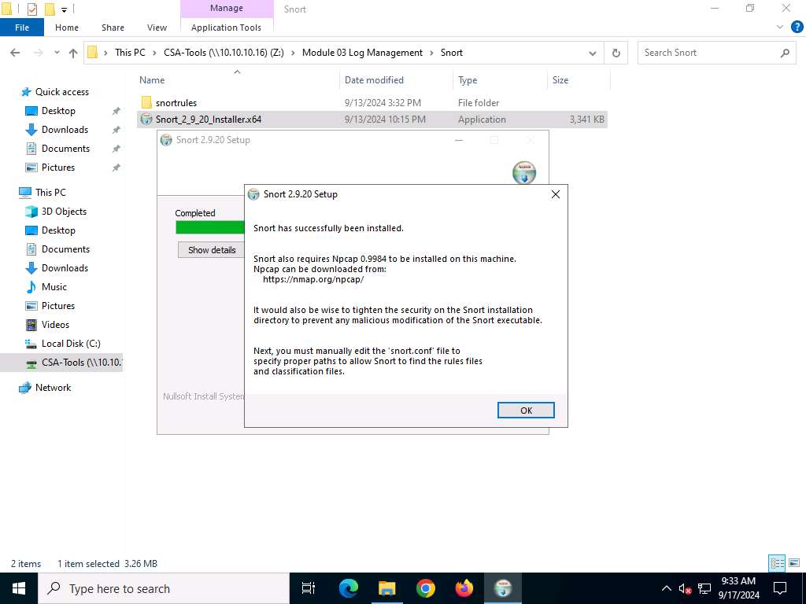
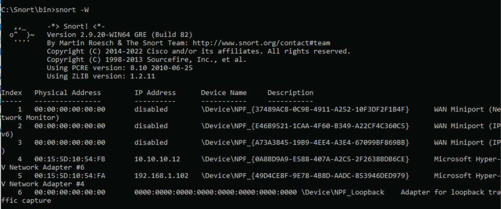
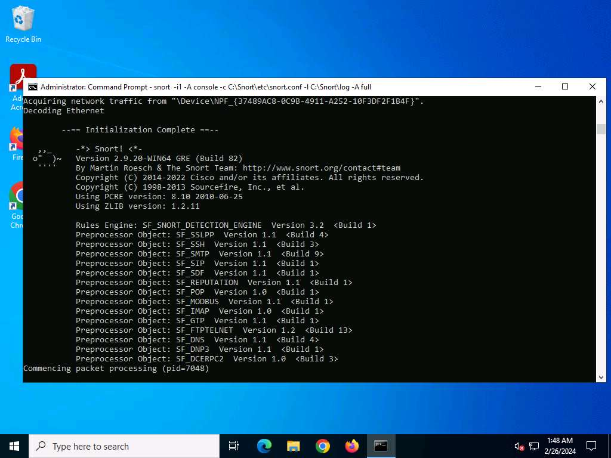
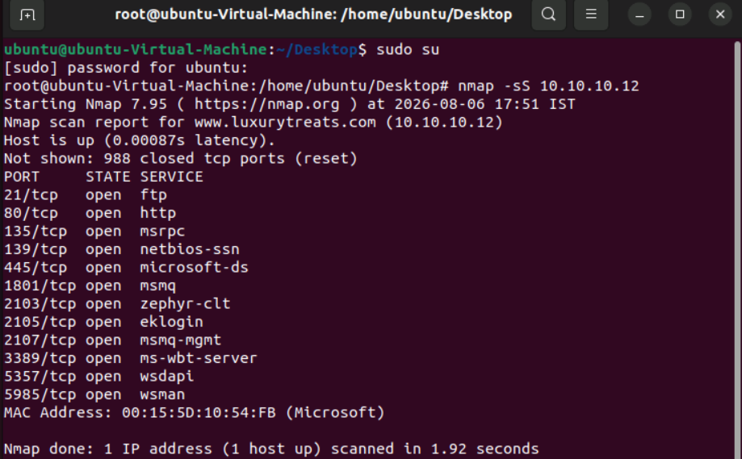
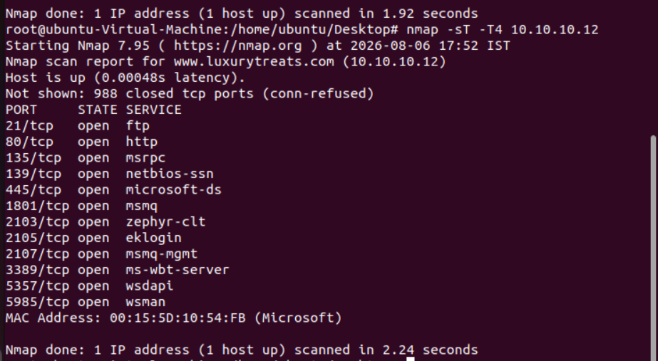
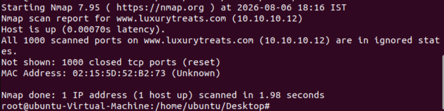
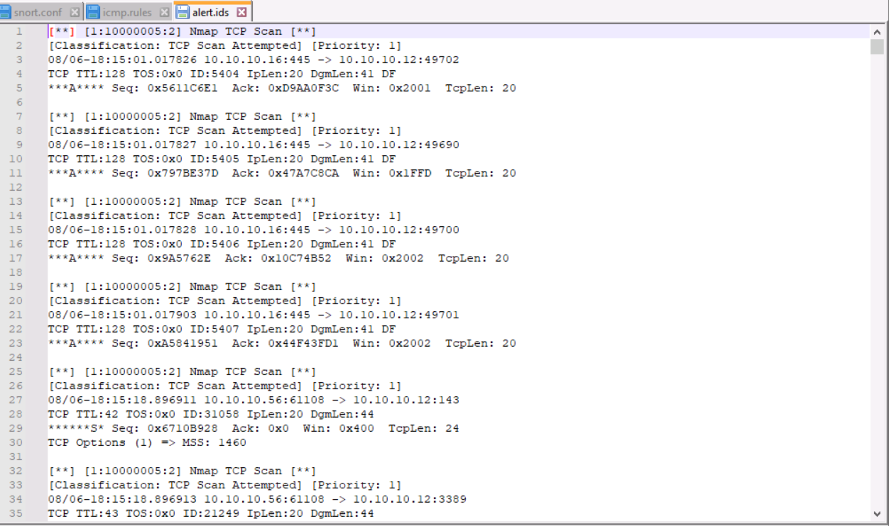
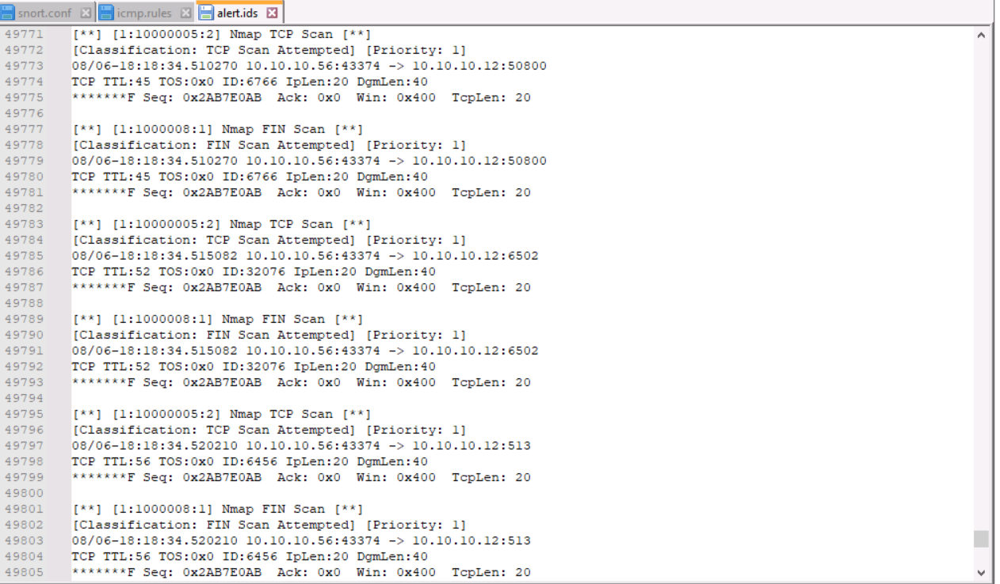

# Snort IDS Logs

## Configuring, Monitoring, and Analyzing Snort IDS Logs

Snort is an open-source, free, and lightweight Network Intrusion Detection System (NIDS). It monitors network traffic and generates alerts when suspicious or malicious activity matches predefined rules. Monitoring Snort logs helps identify and prevent various network attacks.

As a SOC Analyst, you should be aware of the logging mechanisms of network security applications such as Firewalls, IDS, and IPS. These logs help detect and investigate network-related security anomalies.

---

## 1. Configure Snort IDS

Open the **Web Server (Windows 10)**.

Download and install Snort using the installer:

```text
Snort_2_9_24_Installer.x64
```



Download **Npcap** by visiting **npcap.com** using Google Chrome. Scroll down and download the **Npcap 1.80 Installer**.

After installing Snort, replace the default configuration files.

### Configuration Steps

i. Navigate to:

```text
Download\Snort\snortrules\etc
```

Copy **snort.conf** and paste it into:

```text
C:\Snort\etc
```

ii. Copy the following folders from:

```text
Download\Snort\snortrules
```

to

```text
C:\Snort
```

- so_rules
- preproc_rules
- rules

---

## Verify Snort Installation

Open Command Prompt inside:

```text
C:\Snort\bin
```

Run Snort to verify that it is installed correctly.

The message **Initialization Complete** followed by **Commencing packet processing** indicates that Snort is configured successfully.

Next, run:

```bash
snort -W
```

This command lists the available network interfaces, including the interface number, MAC address, IP address, and Ethernet driver.



Enable the correct network interface.

Example:

```bash
snort -dev -i 4
```

---

## Configure snort.conf

Navigate to:

```text
C:\Snort\etc
```

Open **snort.conf** using **Notepad++**.

### Step 1 - Configure Network Variables

- Replace **ipvar** with **var**.
- Set **HOME_NET** to:

```text
10.10.10.12/24
```

- Configure the rule paths.

Replace:

```text
../rules
```

with

```text
c:\Snort\rules
```

Replace:

```text
../so_rules
```

with

```text
c:\Snort\so_rules
```

Replace:

```text
../preproc_rules
```

with

```text
c:\Snort\preproc_rules
```

Similarly, configure the following variables:

- WHITE_LIST_PATH
- BLACK_LIST_PATH

using

```text
c:\Snort\rules
```

Create two files inside:

```text
C:\Snort\rules
```

- white_list.rules
- black_list.rules

---

### Step 2 - Configure Log Directory

Uncomment the following line and change the directory to:

```text
config logdir: c:\Snort\log
```

---

### Step 3 - Configure Dynamic Libraries

Replace

```text
/usr/local/lib/snort_dynamicpreprocessor/
```

with

```text
c:\Snort\lib\snort_dynamicpreprocessor
```

Replace

```text
/usr/local/lib/snort_dynamicengine/libsf_engine.so
```

with

```text
c:\Snort\lib\snort_dynamicengine\sf_engine.dll
```

Comment the dynamic rule library path.

---

### Step 4 - Configure Preprocessors

Comment all preprocessors listed in this section.

Remove the backslash (`\`) from lines 507–511 and comment lines 507–512.

---

### Step 5 - Configure Output Plugins

Replace the include statements with:

```text
include c:\Snort\etc\classification.config
include c:\Snort\etc\reference.config
```

Add the following line:

```text
output alert_fast: alert.ids
```

Save the **snort.conf** file.

---

## Configure Classification

Open:

```text
C:\Snort\etc\classification.config
```

Add the following entries at the end of the file.

```text
config classification: TCP-Scan,TCP Scan Attempted,1
config classification: Xmas-Scan,Xmas Scan Attempted,1
config classification: FIN-Scan,FIN Scan Attempted,1
```

---

## Add Detection Rules

Navigate to:

```text
C:\Snort\rules
```

Open **icmp.rules** and add the following rules.

```text
alert tcp $EXTERNAL_NET any -> $HOME_NET any (msg:"Nmap TCP Scan"; sid:10000005; rev:2; classtype:TCP-Scan)

alert tcp $EXTERNAL_NET any -> $HOME_NET any (msg:"Nmap XMAS Scan"; flags:FPU; sid:1000006; rev:1; classtype:Xmas-Scan)

alert tcp $EXTERNAL_NET any -> $HOME_NET any (msg:"Nmap FIN Scan"; flags:F; sid:1000008; rev:1; classtype:FIN-Scan)
```

Save the file.

---

## Start Snort

Run Snort using the following command.

```bash
snort -i4 -A console -c C:\Snort\etc\snort.conf -l C:\Snort\log -A full
```

Here, **4** represents the network interface connected to the Web Server.

If everything is configured correctly, Snort displays:

```text
Commencing packet processing
```



Leave Snort running to monitor network traffic.

---

## Generate Network Traffic

Start the **Attacker Machine (Ubuntu)**.

Open the terminal and switch to the root user.

### SYN Scan

```bash
nmap -sS 10.10.10.12
```



### TCP Connect Scan

```bash
nmap -sT -T4 10.10.10.12
```



### NULL Scan

```bash
nmap -sN -T4 -A -v 10.10.10.12
```

### XMAS Scan

```bash
nmap -sX -T4 10.10.10.12
```



### FIN Scan

```bash
nmap -sF -T4 10.10.10.12
```

The FIN scan exploits a behavior defined in the TCP RFC to identify open and closed ports.

### UDP Scan

```bash
nmap -sU -T5 10.10.10.12
```

The scan shows that UDP port **137** is open.

---

## Verify Snort Logs

Return to the **Web Server**.

Navigate to:

```text
C:\Snort\log
```

Open the **alert.ids** file using **Notepad++**.





The **alert.ids** file contains alerts generated by Snort for the network scanning attempts performed using Nmap.

---

## Log Storage Location

Snort stores alert logs in:

```text
C:\Snort\log
```

These logs can later be forwarded to Splunk Enterprise for centralized monitoring, searching, dashboard creation, and threat detection.

In this way, Snort IDS keeps track of network activities and records suspicious events in the form of alert logs.